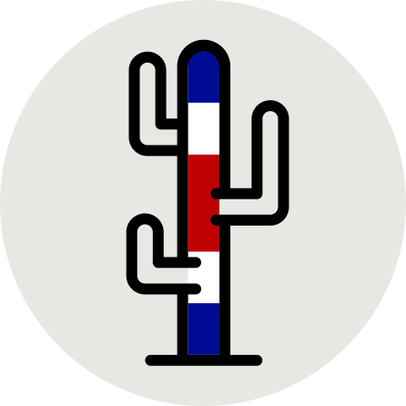

<div align="center">
    <p>🌿🌿🌿🌿🌿🌿🌿🌿🌿🌿🌿🌿🌿🌿🌿🌿🌿🌿🌿🌿🌿🌿🌿🌿🌿🌿🌿🌿🌿🌿🌿🌿🌿🌿🌿🌿🌿🌿🌿</p>
</div>

<br>

<div align="center">
    
</div>

<br>

<div align="center">
    <h2>🌵 Prototype of Cacti and Succulents Shopping App 🌱.</h2>
    <a href="https://www.youtube.com/watch?v=9MUC6YLMSIU">► See the demo here ◄</a>
</div>

<br>
<br>

<div align="center">

<a href="https://www.mongodb.com/es"></a>
<a href="https://www.fastify.io"></a>
<a href="https://es.reactjs.org"></a>
<a href="https://nodejs.org/"></a>

<br>

<a href="https://nextjs.org"></a>
<a href="https://www.typescriptlang.org/"></a>
<a href="https://tailwindcss.com"></a>
<a href="https://es.shopify.com/"></a>
<a href="https://graphql.org"></a>
<a href="https://auth0.com"></a>

</div>

<br>

<div align="center">
    <p>🌿🌿🌿🌿🌿🌿🌿🌿🌿🌿🌿🌿🌿🌿🌿🌿🌿🌿🌿🌿🌿🌿🌿🌿🌿🌿🌿🌿🌿🌿🌿🌿🌿🌿🌿🌿🌿🌿🌿</p>
</div>

<br>
<br>

## **⊙ Index**

---

1. [About](#⊙-about)
2. [Motivation](#⊙-motivation)
3. [Instalation](#⊙-instalation)
4. [Dependencies](#⊙-dependencies)
5. [Structure](#⊙-structure)
6. [Acknowledgments](#⊙-acknowledgments)
7. [Licenses](#⊙-licenses)

<br>
<br>

## **⊙ About**

---

> Enjoy buying your favorite plants 🌺.

> Final-course project. Next.js app, made during the CORE Code School bootcamp. It corresponds to a shooping app for an online store that simulates seeing, listing and buying products 👨‍💻.

> Its main product are cacti and succulents. It shows main information about the plants itself and their maintenance 🌵.

> Store can be contextualized or adapted to other types of products/stores 🏪.

<br>
<br>

## **⊙ Motivation**

---

I wanted to create a big project, something useful and practical, so I decided to make this Headless CMS Shopify shop to get more knowledge with Next.js and React, to improve my experience as a developer.

<br>
<br>

## **⊙ Instalation**

---

Clone the project with SSH or HTTPS
```
git clone git@github.com:Systrent/Cacti-Co.git
```

Install dependencies
```
yarn install
```

Start the application on each one, frontend and backend
```
yarn run dev
```

<br>
<br>

## **⊙ Dependencies**

---

Project dependencies:

-   [React](https://es.reactjs.org)
-   [Typescript](https://www.typescriptlang.org/)
-   [Shopify](https://es.shopify.com)
-   [Node.js](https://nodejs.org/)
-   [Auth0](https://auth0.com)
-   [Nodemon](https://nodemon.io)
-   [Mongoose](https://mongoosejs.com)
-   [Axios](https://axios-http.com)
-   [SWR](https://swr.vercel.app/es-ES)
-   [Emotion](https://emotion.sh/docs/introduction)
-   [Twin.macro](https://github.com/ben-rogerson/twin.macro)

<br>
<br>

## **⊙ Structure**

---

### — Frontend:

```
├───📁 components/
│   ├───📁 home/
│   │   ├───📄 HomeSection.tsx       
│   │   ├───📄 MainProduct.tsx       
│   │   ├───📄 ProductCard.tsx       
│   │   ├───📄 ProductList.tsx       
│   │   └───📄 SectionTitle.tsx      
│   ├───📁 info/
│   │   ├───📄 InputButton.tsx       
│   │   └───📄 NewCactusForm.tsx     
│   ├───📁 layout/
│   │   ├───📄 Footer.tsx
│   │   ├───📄 Header.tsx
│   │   ├───📄 HeaderButton.tsx      
│   │   ├───📄 Layout.tsx
│   │   ├───📄 LoginButton.tsx       
│   │   ├───📄 Logo.tsx
│   │   └───📄 MainMenu.tsx
│   ├───📁 maintenance/
│   │   └───📄 WorkInProgress.tsx    
│   ├───📁 orders/
│   │   ├───📄 CheckoutButton.tsx    
│   │   ├───📄 OrdersProductCard.tsx 
│   │   ├───📄 OrdersProductList.tsx 
│   │   ├───📄 OrdersSection.tsx     
│   │   ├───📄 OrdersSectionTitle.tsx
│   │   └───📄 SingleOrderSection.tsx
│   ├───📁 profile/
│   │   ├───📄 FavoriteProducts.tsx
│   │   ├───📄 InputButton.tsx
│   │   ├───📄 NewProfileForm.tsx
│   │   └───📄 ProfileCard.tsx
│   ├───📁 shared/
│   │   ├───📄 AuthenticatedApp.tsx
│   │   ├───📄 Background.tsx
│   │   ├───📄 Spinner.tsx
│   │   └───📄 TokenApp.tsx
│   └───📁 weather/
│       ├───📄 DeleteRecommendation.tsx
│       ├───📄 NewRecommendation.tsx
│       ├───📄 RecommendationCard.tsx
│       ├───📄 RecommendationCardDelete.tsx
│       ├───📄 RecommendationList.tsx
│       └───📄 WeatherSection.tsx
├───📁 lib/
│   ├───📁 connection/
│   │   └───📄 backendAPI.ts
│   ├───📁 context/
│   │   └───📄 tokenContext.ts
│   ├───📁 extra/
│   │   └───📄 formatCurrency.ts
│   ├───📁 fetching/
│   │   ├───📄 authenticatedFetcher.ts
│   │   └───📄 publicFetcher.ts
│   ├───📁 profile/
│   │   └───📄 createProfile.ts
│   └───📁 recommendation/
│       ├───📄 createRecommendation.ts
│       └───📄 deleteRecommendation.ts
├───📁 pages/
│   ├───📁 info/
│   │   └───📄 index.tsx
│   ├───📁 orders/
│   │   ├───📄 index.tsx
│   │   └───📄 [handle].tsx
│   ├───📁 profile/
│   │   └───📄 index.tsx
│   ├───📁 weather/
│   │   ├───📁 admin/
│   │   │   └───📄 create.tsx
│   │   └───📄 index.tsx
│   ├───📄 index.tsx
│   ├───📄 _app.tsx
│   └───📄 _document.tsx
├───📁 public/
│   └───📁 images/
│       ├───📄 cacti_co_favicon.svg
│       ├───📄 cacti_co_logo.svg
│       ├───📄 cacti_co_logo2.svg
│       ├───📄 cacti_co_pet.svg
│       └───📄 product_test.png
├───📁 styles/
│   └───📄 globals.css
├───📁 types/
│   └───📄 emotion.d.ts
├───📄 .babelrc
├───📄 .gitignore
├───📄 next-env.d.ts
├───📄 package.json
├───📄 postcss.config.js
├───📄 tailwind.config.js
├───📄 tsconfig.json
└───📄 yarn.lock
```

### — Backend:

```
├───📁 src/
│   ├───📁 database/
│   │   └───📄 db.ts
│   ├───📁 models/
│   │   ├───📄 favorite.model.ts
│   │   ├───📄 profile.model.ts
│   │   └───📄 recommendation.model.ts
│   ├───📁 routes/
│   │   ├───📁 favorites/
│   │   │   ├───📄 createFavorite.ts
│   │   │   ├───📄 deleteFavorite.ts
│   │   │   ├───📄 favoriteApp.ts
│   │   │   └───📄 findFavorite.ts
│   │   ├───📁 profile/
│   │   │   ├───📄 createProfile.ts
│   │   │   ├───📄 findProfile.ts
│   │   │   └───📄 profileApp.ts
│   │   ├───📁 recommendations/
│   │   │   ├───📄 createRecommendation.ts
│   │   │   ├───📄 deleteRecommendation.ts
│   │   │   ├───📄 findRecommendation.ts
│   │   │   └───📄 recommendationApp.ts
│   │   └───📁 shopify/
│   │       ├───📄 allProductsQuery.ts
│   │       ├───📄 checkoutMutation.ts
│   │       ├───📄 shopifyApp.ts
│   │       └───📄 singleProductQuery.ts
│   ├───📄 app.ts
│   ├───📄 config.ts
│   ├───📄 seed.ts
│   └───📄 server.ts
├───📄 package.json
├───📄 tsconfig.json
└───📄 yarn.lock
```

<br>
<br>

## **⊙ Acknowledgments**

---
  
This project is made thanks to the mentorship of the teacher [@boyander](https://github.com/boyander), as the head of Core Code School's FullStack Bootcamp. In additon want to thanks to my partner [@AlfonsoValle](https://github.com/AlfonsoValle), because we did a tough pair programming sessions that helped me a lot.

<br>
<br>

## **⊙ Licenses**

---

```
MIT License

Copyright (c) 2022 Juan Pablo Mora Serrano

Permission is hereby granted, free of charge, to any person obtaining a copy
of this software and associated documentation files (the "Software"), to deal
in the Software without restriction, including without limitation the rights
to use, copy, modify, merge, publish, distribute, sublicense, and/or sell
copies of the Software, and to permit persons to whom the Software is
furnished to do so, subject to the following conditions:

The above copyright notice and this permission notice shall be included in all
copies or substantial portions of the Software.

THE SOFTWARE IS PROVIDED "AS IS", WITHOUT WARRANTY OF ANY KIND, EXPRESS OR
IMPLIED, INCLUDING BUT NOT LIMITED TO THE WARRANTIES OF MERCHANTABILITY,
FITNESS FOR A PARTICULAR PURPOSE AND NONINFRINGEMENT. IN NO EVENT SHALL THE
AUTHORS OR COPYRIGHT HOLDERS BE LIABLE FOR ANY CLAIM, DAMAGES OR OTHER
LIABILITY, WHETHER IN AN ACTION OF CONTRACT, TORT OR OTHERWISE, ARISING FROM,
OUT OF OR IN CONNECTION WITH THE SOFTWARE OR THE USE OR OTHER DEALINGS IN THE
SOFTWARE.
```
